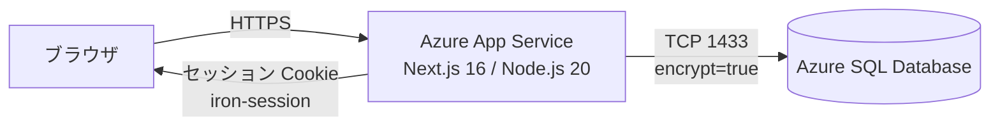
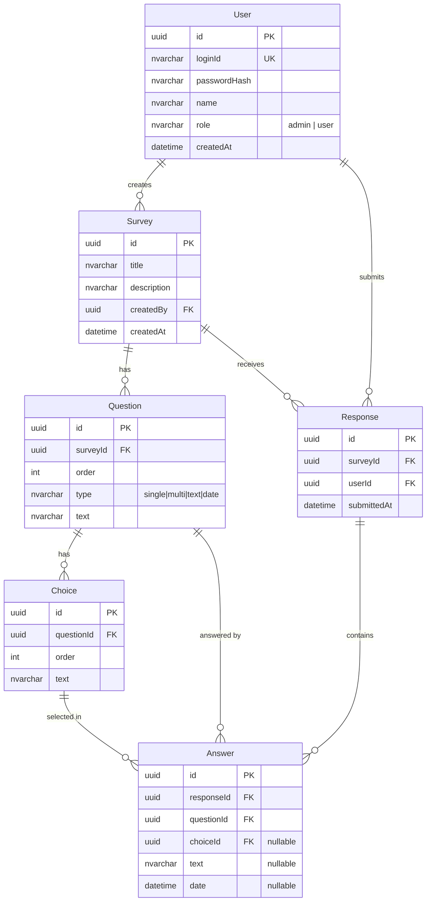
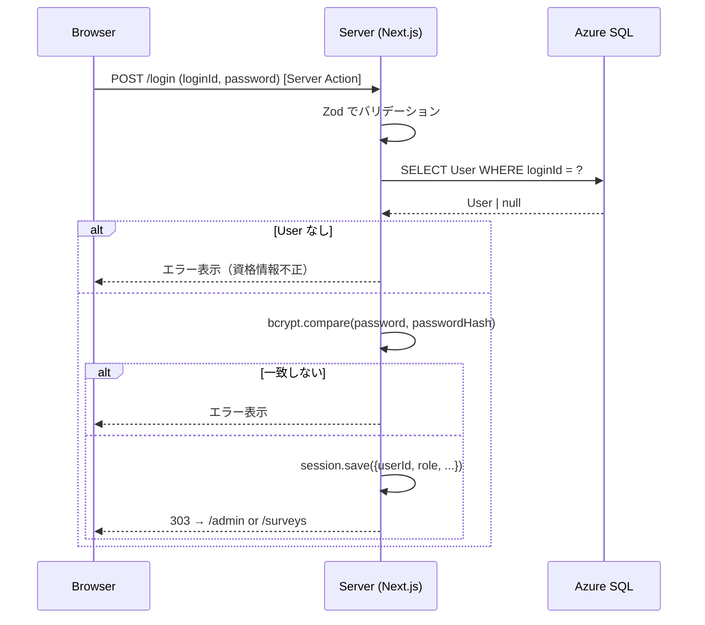
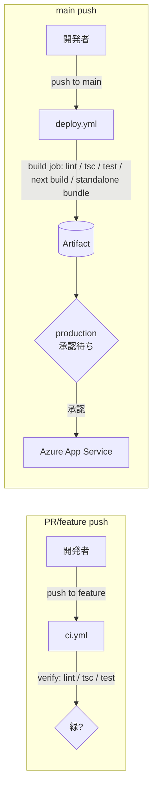

# アンケート集計システム 設計書

## 1. 概要

### 1.1 目的
社内のアンケート運用を Web 上で完結させるため、以下を提供する。

- 管理者が Web 画面上でアンケートを作成・運用できる
- 事前登録されたユーザー（回答者）がログインして回答できる
- 管理者が回答を CSV でダウンロードし、Excel 等で分析できる

### 1.2 対象ユーザー

| ロール | 説明 |
|---|---|
| 管理者 (admin) | アンケート・ユーザーの管理、回答データのダウンロード |
| 回答者 (user) | ログイン後、自身に公開されたアンケートへ回答 |

### 1.3 主要機能

| 分類 | 機能 |
|---|---|
| 認証 | ユーザーID／パスワードによるログイン・ログアウト |
| 管理者：ユーザー管理 | CSV 一括登録、一覧表示、削除 |
| 管理者：アンケート管理 | 作成（質問追加／選択肢追加／並び替え）、一覧表示、詳細表示、削除 |
| 管理者：回答データ | アンケート別 CSV ダウンロード（UTF-8 BOM 付き） |
| 回答者 | 自分宛アンケート一覧、回答フォーム、送信（1回のみ） |
| 質問タイプ | 単一選択 / 複数選択 / 自由記述 / 日付 |

---

## 2. 技術スタック

| 区分 | 採用技術 | バージョン | 備考 |
|---|---|---|---|
| Framework | Next.js (App Router) | 16.2.4 | Server Actions / Proxy (旧 middleware) |
| UI ライブラリ | React | 19.2.4 | Server Components 中心 |
| CSS | Tailwind CSS | v4 | `@tailwindcss/postcss` |
| ORM | Prisma | 7.8.0 | `prisma.config.ts` + datasource は環境変数 |
| DB アダプタ | `@prisma/adapter-mssql` | 7.8.0 | `mssql` パッケージ経由 |
| データベース | Azure SQL Database | - | SQL Server 互換 |
| 認証 | iron-session | 8.0.4 | 暗号化セッション Cookie |
| パスワード | bcrypt | 6.0.0 | saltRounds=10 |
| バリデーション | Zod | 4.x | Server Action 入力検証 / 環境変数検証 |
| テスト | Vitest | 2.x | jsdom 環境、`@vitest/coverage-v8` |
| ランタイム | Node.js | 20.9+ | Next.js 16 最低要件 |
| デプロイ先 | Azure App Service (Linux) | Node 20 LTS | Oryx ビルダー |

---

## 3. システム構成



### 3.1 リクエストフロー

1. ブラウザから Next.js App Service にリクエスト
2. `proxy.ts`（旧 middleware）がセッション Cookie を検証し、未認証なら `/login` にリダイレクト
3. 認証済みの場合はロールをチェックし、Server Component でページを描画
4. フォーム送信は Server Action で処理、Prisma Client 経由で Azure SQL にクエリ

### 3.2 ルート保護ポリシー

| URL パターン | 認証 | 認可 |
|---|---|---|
| `/login` | 不要 | 認証済みはロールに応じて `/admin` or `/surveys` にリダイレクト |
| `/admin/**` | 必要 | role = admin のみ。それ以外は `/surveys` にリダイレクト |
| `/surveys/**` | 必要 | 全認証ユーザー |
| `/` | 必要 | ロールに応じてリダイレクト |

---

## 4. ディレクトリ構成

```
claudedemo/
├── prisma/
│   ├── schema.prisma                 # DB スキーマ
│   ├── seed.ts                       # 初期管理者登録
│   └── migrations/                   # マイグレーション履歴
├── prisma.config.ts                  # Prisma 7: datasource.url を環境変数から解決
├── proxy.ts                          # ルート保護 (旧 middleware)
├── next.config.ts                    # standalone 出力 + Prisma/mssql 同梱設定
├── vitest.config.ts                  # Vitest 設定（jsdom + パスエイリアス）
├── src/
│   ├── app/
│   │   ├── layout.tsx                # ルートレイアウト
│   │   ├── page.tsx                  # トップ（ロールでリダイレクト）
│   │   ├── globals.css
│   │   ├── login/
│   │   │   ├── page.tsx
│   │   │   └── login-form.tsx        # Client Component
│   │   ├── actions/
│   │   │   └── auth.ts               # login / logout
│   │   ├── admin/                    # 管理者画面（layout で requireAdmin）
│   │   │   ├── layout.tsx
│   │   │   ├── page.tsx              # アンケート一覧
│   │   │   ├── users/
│   │   │   │   ├── page.tsx
│   │   │   │   ├── import-form.tsx
│   │   │   │   ├── delete-button.tsx
│   │   │   │   └── actions.ts
│   │   │   └── surveys/
│   │   │       ├── actions.ts        # createSurvey / deleteSurvey
│   │   │       ├── new/
│   │   │       │   ├── page.tsx
│   │   │       │   └── survey-builder.tsx
│   │   │       └── [id]/
│   │   │           ├── page.tsx      # アンケート詳細
│   │   │           ├── delete-button.tsx
│   │   │           └── download/
│   │   │               └── route.ts  # CSV ダウンロード Route Handler
│   │   └── surveys/                  # 回答者画面（layout で requireUser）
│   │       ├── layout.tsx
│   │       ├── page.tsx              # アンケート一覧
│   │       ├── actions.ts            # submitResponse
│   │       └── [id]/
│   │           ├── page.tsx          # 回答画面
│   │           └── survey-form.tsx
│   ├── components/
│   │   └── header.tsx                # 共通ヘッダー
│   └── lib/
│       ├── db.ts                     # PrismaClient（Proxy で遅延初期化）
│       ├── env.ts                    # 環境変数の起動時検証（zod / fail-fast）
│       ├── session.ts                # iron-session ヘルパー
│       ├── schemas.ts                # zod スキーマ集約（Server Action から分離）
│       ├── csv.ts                    # CSV パース / 生成
│       ├── csv.test.ts               # CSV ロジックの単体テスト
│       └── schemas.test.ts           # zod スキーマの単体テスト
├── docs/
│   ├── design.md                     # この設計書
│   └── testing.md                    # テスト・CI 運用ガイド
├── .github/
│   └── workflows/
│       ├── ci.yml                    # PR/非 main push 時の検証ワークフロー
│       └── deploy.yml                # main push 時のビルド＋デプロイワークフロー
├── package.json
├── tsconfig.json
└── README.md
```

開発規約・コマンド集はリポジトリ直下の [AGENTS.md](../AGENTS.md) を参照。本書は「何がどう作られているか」、AGENTS.md は「どう書くか・どう動かすか」を担当する。

---

## 5. データモデル

### 5.1 ER 図



### 5.2 テーブル定義

#### User
| カラム | 型 | 制約 | 備考 |
|---|---|---|---|
| id | UniqueIdentifier | PK | `default(uuid())` |
| loginId | NVarChar(100) | UNIQUE, NOT NULL | ログインID |
| passwordHash | NVarChar(255) | NOT NULL | bcrypt ハッシュ |
| name | NVarChar(100) | NOT NULL | 氏名 |
| role | NVarChar(20) | NOT NULL, default='user' | `admin` / `user` |
| createdAt | DateTime | default(now()) | |

#### Survey
| カラム | 型 | 制約 | 備考 |
|---|---|---|---|
| id | UniqueIdentifier | PK | |
| title | NVarChar(200) | NOT NULL | |
| description | NVarChar(1000) | NULL可 | |
| createdBy | UniqueIdentifier | FK → User.id (NoAction) | 作成者 |
| createdAt | DateTime | default(now()) | |

#### Question
| カラム | 型 | 制約 | 備考 |
|---|---|---|---|
| id | UniqueIdentifier | PK | |
| surveyId | UniqueIdentifier | FK → Survey.id (Cascade) | |
| order | Int | NOT NULL | 表示順 |
| type | NVarChar(20) | NOT NULL | `single` / `multi` / `text` / `date` |
| text | NVarChar(500) | NOT NULL | 質問文 |

INDEX: `surveyId`

#### Choice
| カラム | 型 | 制約 | 備考 |
|---|---|---|---|
| id | UniqueIdentifier | PK | |
| questionId | UniqueIdentifier | FK → Question.id (Cascade) | |
| order | Int | NOT NULL | |
| text | NVarChar(500) | NOT NULL | |

INDEX: `questionId`

#### Response
| カラム | 型 | 制約 | 備考 |
|---|---|---|---|
| id | UniqueIdentifier | PK | |
| surveyId | UniqueIdentifier | FK → Survey.id (Cascade) | |
| userId | UniqueIdentifier | FK → User.id (NoAction) | |
| submittedAt | DateTime | default(now()) | |

UNIQUE: `(surveyId, userId)` ← **1アンケート1回答制約**
INDEX: `surveyId`

#### Answer
| カラム | 型 | 制約 | 備考 |
|---|---|---|---|
| id | UniqueIdentifier | PK | |
| responseId | UniqueIdentifier | FK → Response.id (Cascade) | |
| questionId | UniqueIdentifier | FK → Question.id (NoAction) | |
| choiceId | UniqueIdentifier | FK → Choice.id (NoAction), NULL可 | 選択式の回答 |
| text | NVarChar(2000) | NULL可 | 自由記述 |
| date | DateTime | NULL可 | 日付回答 |

INDEX: `responseId`, `questionId`

### 5.3 カスケード削除ポリシー

SQL Server は循環カスケードを許容しないため、削除伝播は以下の通り明示指定。

| 親 → 子 | onDelete |
|---|---|
| Survey → Question | Cascade |
| Survey → Response | Cascade |
| Question → Choice | Cascade |
| Response → Answer | Cascade |
| Question → Answer | **NoAction** |
| Choice → Answer | **NoAction** |
| User → Response | **NoAction** |
| User → Survey | **NoAction** |

→ アンケート削除時は Survey→Question→Choice と Survey→Response→Answer の2経路で子レコードが削除される。

### 5.4 質問タイプごとの Answer 格納パターン

| type | 入力 UI | 格納先 | 1質問に対する Answer レコード数 |
|---|---|---|---|
| single | ラジオボタン | `choiceId` | 1 |
| multi | チェックボックス | `choiceId`（複数行） | 0〜N（選択数） |
| text | テキストエリア | `text` | 1 |
| date | 日付入力 | `date` | 1 |

---

## 6. 画面一覧

| URL | ロール | 説明 |
|---|---|---|
| `/login` | 未認証 | ログインフォーム |
| `/` | 認証済 | ロールに応じて `/admin` または `/surveys` にリダイレクト |
| `/admin` | admin | アンケート一覧（質問数・回答数表示） |
| `/admin/surveys/new` | admin | アンケート作成 UI |
| `/admin/surveys/[id]` | admin | アンケート詳細（質問プレビュー・CSV DL・削除） |
| `/admin/surveys/[id]/download` | admin | CSV ダウンロード Route Handler |
| `/admin/users` | admin | ユーザー一覧＋CSV 登録＋削除 |
| `/surveys` | user / admin | アンケート一覧（回答済み／未回答を表示分け） |
| `/surveys/[id]` | user / admin | 回答フォーム |

---

## 7. 認証・認可設計

### 7.1 セッション方式

- **iron-session** による**暗号化ステートレスセッション**
- Cookie 名: `survey_session`
- 属性: `httpOnly=true`, `secure=production`, `sameSite=lax`, `path=/`, `maxAge=8h`
- ペイロード: `{ userId, loginId, name, role }`

### 7.2 ルート保護（多層防御）

1. **Proxy 層**（`proxy.ts`）
   - 全リクエストでセッション検証
   - 未認証は `/login` にリダイレクト
   - `/admin/**` への非 admin アクセスは `/surveys` にリダイレクト
2. **Layout 層**
   - `/admin/layout.tsx` で `requireAdmin()` を呼び、フェイルセーフ
   - `/surveys/layout.tsx` で `requireUser()`
3. **Server Action / Route Handler 層**
   - 各 Server Action 冒頭で `requireUser()` または `requireAdmin()` を呼ぶ
   - Route Handler も同様

### 7.3 ログインフロー



### 7.4 パスワードポリシー

- 保存時: bcrypt (saltRounds=10)
- 初期管理者: `.env` の `ADMIN_PASSWORD` を seed で登録
- CSV 一括登録: 平文をCSVで受け取り、サーバー側で bcrypt してから INSERT

### 7.5 環境変数の起動時検証（fail-fast）

`src/lib/env.ts` がアプリ起動時に `process.env` を zod で検証し、不足や不正があれば即座に `process.exit(1)` する。

| 変数 | バリデーション |
|---|---|
| `DATABASE_URL` | 1 文字以上（空文字不可） |
| `SESSION_SECRET` | **32 文字以上**（iron-session の暗号鍵長要件） |
| `NODE_ENV` | `development` / `production` / `test` のいずれか |

`db.ts` / `session.ts` から `env.ts` を import するため、開発・本番のどちらでも「環境変数の取り違えで本番デプロイ後にログイン失敗で気づく」事故を防ぐ。

---

## 8. Server Actions / Route Handlers

### 8.1 共通方針

- 入力検証はすべて **`src/lib/schemas.ts` に集約された zod スキーマ** を使う
  - Server Action から DB / `next/*` 依存を切り離すことで、スキーマ単位で単体テスト可能
  - 実テストは [`src/lib/schemas.test.ts`](../src/lib/schemas.test.ts) を参照
- 認証チェックを冒頭で実施（`requireUser()` / `requireAdmin()`）
- 失敗時は `{ ok: false, message }` を返し、`useActionState` 側で表示
- 関連レコードの作成は Prisma の nested write / `$transaction` で原子性を確保

### 8.2 認証

| ファイル | エクスポート | 引数 | 処理 |
|---|---|---|---|
| `src/app/actions/auth.ts` | `login` | prevState, FormData | `LoginSchema` 検証→bcrypt 比較→セッション作成→リダイレクト |
| 同上 | `logout` | なし | セッション破棄→`/login` |

### 8.3 管理者：ユーザー管理

| ファイル | エクスポート | 処理 |
|---|---|---|
| `src/app/admin/users/actions.ts` | `importUsersFromCsv` | CSV パース→行ごとにバリデーション→bcrypt→INSERT（重複スキップ） |
| 同上 | `deleteUser` | User 削除（User → Response は NoAction なので、回答済みユーザーは事前に Response を消す or 制約違反で失敗） |

### 8.4 管理者：アンケート管理

| ファイル | エクスポート | 処理 |
|---|---|---|
| `src/app/admin/surveys/actions.ts` | `createSurvey` | `SurveyInputSchema` で JSON 検証→選択肢2件以上の追加チェック→Survey/Question/Choice の入れ子 create |
| 同上 | `deleteSurvey` | Survey 削除（Cascade で Question/Choice/Response/Answer 連鎖削除） |

### 8.5 管理者：CSV ダウンロード

| ファイル | メソッド | 処理 |
|---|---|---|
| `src/app/admin/surveys/[id]/download/route.ts` | GET | `getSession()` で認可チェック→Survey 全データ取得→CSV 生成→UTF-8 BOM 付きで返却 |

#### レスポンスヘッダ
```
Content-Type: text/csv; charset=utf-8
Content-Disposition: attachment; filename*=UTF-8''{title}_回答.csv
Cache-Control: no-store
```

> ⚠ Route Handler は `/admin/layout.tsx` を経由しないため、`requireAdmin()` ではなく `getSession()` で個別に権限を確認する。

### 8.6 回答者

| ファイル | エクスポート | 処理 |
|---|---|---|
| `src/app/surveys/actions.ts` | `submitResponse` | `SubmitSchema` 検証→既回答チェック（UNIQUE 制約と二重防御）→Response + Answer 作成 |

---

## 9. CSV フォーマット

### 9.1 ユーザー一括登録（入力）

```csv
loginId,name,password,role
user001,山田太郎,pass1234,user
user002,佐藤花子,pass1234,user
admin2,運営管理者,strongPass,admin
```

- 1行目: ヘッダ必須
- `role` 省略時は `user`
- 既存 `loginId` はスキップ（重複エラーではなく警告）
- パスワードは登録時に bcrypt ハッシュ化（平文 DB 保存なし）

### 9.2 回答データダウンロード（出力）

```csv
ユーザーID,氏名,回答日時,Q1. 満足度は？,Q2. 選択肢（複数可）,Q3. ご意見,Q4. 利用開始日
user001,山田太郎,2026-05-01 10:23:45,満足,選択肢A; 選択肢C,良かったです,2026-04-15
...
```

- UTF-8 BOM 付き（Excel で文字化け防止）
- 複数選択は `; ` 区切り
- 日付は `YYYY-MM-DD`
- ダブルクォート・カンマを含むセルは RFC4180 に従いエスケープ
- 改行は **CRLF**（`src/lib/csv.ts` のビルダ実装）

---

## 10. セキュリティ対策

| 観点 | 対策 |
|---|---|
| パスワード | bcrypt (saltRounds=10) 保存。平文 DB 保存なし |
| セッション改竄 | iron-session による署名付き暗号化 Cookie |
| CSRF | Server Actions は Next.js が自動で Origin チェック |
| SQL Injection | Prisma によるパラメタライズドクエリ |
| XSS | React の JSX エスケープ。`dangerouslySetInnerHTML` 未使用 |
| 認可 | Proxy + Layout + Action の3層で検証 |
| 環境変数 | `src/lib/env.ts` で起動時に zod 検証。`SESSION_SECRET` は 32 文字以上必須 |
| 機密情報 | `.env` は `.gitignore` 除外。CI/デプロイには GitHub Secrets / App Service アプリケーション設定を使用 |
| 通信 | Azure SQL `encrypt=true`, App Service は HTTPS 強制推奨 |
| 1アンケート1回答 | DB UNIQUE 制約 + サーバー側事前チェック |

---

## 11. Azure App Service デプロイ構成

### 11.1 必要リソース

| リソース | SKU / 設定例 |
|---|---|
| App Service Plan (Linux) | B1 以上 |
| App Service (`sgclaudedemo`) | Node 20 LTS ランタイム / japaneast |
| Azure SQL Server / Database | S0 以上、Azure AD / SQL 認証 |

公開 URL: <https://sgclaudedemo.azurewebsites.net>

### 11.2 環境変数（App Service アプリケーション設定）

| Key | 値 |
|---|---|
| `DATABASE_URL` | `sqlserver://<server>.database.windows.net:1433;database=<db>;user=<user>;password=<pw>;encrypt=true;trustServerCertificate=false;hostNameInCertificate=*.database.windows.net` |
| `SESSION_SECRET` | **32 文字以上**のランダム文字列（未満だと起動時に env.ts が `exit(1)`） |
| `WEBSITE_NODE_DEFAULT_VERSION` | `~20` |
| `SCM_DO_BUILD_DURING_DEPLOYMENT` | `true` |
| `ADMIN_LOGIN_ID` / `ADMIN_PASSWORD` / `ADMIN_NAME` | seed 実行時のみ必要 |

> ⚠ `@prisma/adapter-mssql` は接続文字列の `loginTimeout` / `connectionTimeout` を**ミリ秒**として扱う。秒のつもりで `30` と書くと 30 ms で切断される。**省略推奨**。

### 11.3 ネットワーク

- Azure SQL ファイアウォール: 「Azure サービスからのアクセスを許可」を ON
- App Service の Outbound IP を許可リストに追加してもよい
- App Service 側は HTTPS Only = ON、TLS 1.2+

### 11.4 CI/CD パイプライン

リポジトリには 2 本の GitHub Actions ワークフローを配置している。



#### `.github/workflows/ci.yml`（PR / 非 main push）

| ステップ | 内容 |
|---|---|
| 1 | `npm ci` |
| 2 | `npx prisma generate` |
| 3 | `npm run lint` |
| 4 | `npx tsc --noEmit` |
| 5 | `npm run test`（Vitest） |

GitHub Branch protection rules で `verify` ジョブを必須にすると、緑にならない PR はマージ不可になる。

#### `.github/workflows/deploy.yml`（main push）

build job で同じ検証ステップ（lint / tsc / test）を走らせ、検証が通った場合のみ deploy job に進む。

- ビルド成果物は `output: 'standalone'` の `.next/standalone` を中心に、`public/` と `.next/static/` を組み立てた zip
- `actions/upload-artifact` は **デフォルトでドットディレクトリを除外する** ため `include-hidden-files: true` を明示（さもないと `.next/` が落ちる）
- deploy job には `environment: production` を付与しており、後述の承認フローで停止可能

### 11.5 production 承認ワークフロー

main への push があってもデプロイを即座に走らせない運用。

リポジトリ管理者が GitHub の Settings から手で設定する（Workflow ファイルだけでは反映できない）:

1. **Settings → Environments → New environment** で `production` を作成
2. **Required reviewers** に承認者を 1 人以上追加（自分以外推奨）
3. main push 後、deploy job が「approval 待ち」で停止 → 承認者がポチると初めてデプロイが進む

承認権限を絞ることで「main へ merge した瞬間に本番反映」を防ぎ、デプロイ意思を明示的にする。

### 11.6 next.config.ts の standalone 同梱設定

[`next.config.ts`](../next.config.ts) では `output: 'standalone'` に加えて `outputFileTracingIncludes` で以下を強制同梱している。

```ts
"/*": [
  "node_modules/.prisma/**/*",
  "node_modules/@prisma/client/**/*",
  "node_modules/@prisma/adapter-mssql/**/*",
  "node_modules/mssql/**/*",
  "node_modules/tedious/**/*",
],
```

Next.js のトレース解析が動的 require を追えず Prisma/mssql 系のネイティブ依存をバンドルから落とすことがあるため、明示指定で確実に同梱する。

### 11.7 初回セットアップ手順

1. Azure 上にリソース作成
2. アプリケーション設定（11.2 の表）を登録
3. ソースを main に push → ワークフロー実行 → production 承認 → デプロイ完了
4. Kudu (SCM Basic Auth が必要) コンソールから一回だけ実行:
   ```bash
   npm run db:deploy    # prisma migrate deploy
   npm run db:seed      # 初期管理者登録
   ```
5. Startup Command は `npm start`（standalone の場合は `node server.js` でも可）

---

## 12. テスト戦略

### 12.1 方針

カバレッジ率は追わない。代わりに **「これが壊れたら CI が必ず赤くなる」不変条件** を最低ラインとして守る。

詳細な運用ガイドは [docs/testing.md](./testing.md) を参照。本章はそのうち「設計上の根拠」を示す。

### 12.2 テスト基盤

| 項目 | 内容 |
|---|---|
| ランナー | Vitest 2.x |
| 環境 | jsdom（将来 React コンポーネント単体検証の余地を残すため） |
| 設定 | [`vitest.config.ts`](../vitest.config.ts)（`@/*` パスエイリアス対応） |
| 対象 | `src/**/*.test.{ts,tsx}` |
| 実行 | `npm run test` (CI) / `npm run test:watch`（開発中） |

### 12.3 守っている不変条件

| # | 不変条件 | 対象 |
|---|---|---|
| 1 | CSV パース: クォート・エスケープ・改行・BOM の正しい処理 | `src/lib/csv.test.ts` |
| 2 | CSV ビルド: `"`/`,`/改行のエスケープ、CRLF 改行 | `src/lib/csv.test.ts` |
| 3 | `LoginSchema` が ID/パスワードの空文字を弾く | `src/lib/schemas.test.ts` |
| 4 | `SurveyInputSchema` が質問数 0 / 不正な type / 文字数超過を弾く | `src/lib/schemas.test.ts` |
| 5 | `AnswerInputSchema` が UUID 形式違反 / 文字数超過を弾く | `src/lib/schemas.test.ts` |
| 6 | `SubmitSchema` が surveyId 不正 / answers が配列でない場合を弾く | `src/lib/schemas.test.ts` |

zod スキーマを `src/lib/schemas.ts` に集約した最大の理由は、Server Action から `next/*` / DB 依存を切り離して**スキーマ単位で純粋に単体テスト**するため。

### 12.4 意図的にテストしないもの

| 対象 | 理由 |
|---|---|
| Server Action 全体の統合テスト | DB 構築コストに対して恩恵が薄い。Phase 2 で `prisma.$transaction` 化と合わせて検討 |
| E2E（Playwright 等） | 黄金経路 1〜2 本を Phase 2 課題として保留 |
| React コンポーネントの見た目テスト | 少人数運用で UI 変更頻度が低く、コスト対効果が悪い |
| `requireUser` / `requireAdmin` 単体テスト | `server-only` / `next/headers` / `iron-session` のモック量に対してロジックが素朴すぎる |

---

## 13. 非機能

| 項目 | 方針 |
|---|---|
| 想定同時アクセス | 10〜50 ユーザー程度（社内利用） |
| レスポンス目標 | 画面表示 < 2 秒 |
| ログ | App Service の標準ログ（Log stream / Application Insights 推奨） |
| バックアップ | Azure SQL 自動バックアップ（PITR 7 日デフォルト） |
| 拡張性 | App Service Plan のスケールアップ / アウトで対応 |
| 多言語 | 日本語のみ（現時点） |

---

## 14. 今後の拡張ポイント

- アンケートの対象ユーザー絞り込み（現在は全登録ユーザーに公開）
- 回答期限設定
- 回答の途中保存
- 集計済み結果の可視化（グラフ表示）
- アンケートのコピー機能
- 管理者操作ログ
- Azure AD 認証連携
- **Phase 2 テスト課題**: Server Action の統合テスト（実 DB or testcontainers）／E2E (Playwright) でログイン→回答→CSV ダウンロードの黄金経路 1〜2 本

---

## 15. 参考リンク

- Next.js 16 Upgrade Guide: `node_modules/next/dist/docs/01-app/02-guides/upgrading/version-16.md`
- Prisma 7 Config: <https://pris.ly/d/config-datasource>
- Vitest: <https://vitest.dev/>
- GitHub Environments（承認フロー）: <https://docs.github.com/en/actions/deployment/targeting-different-environments/using-environments-for-deployment>
- リポジトリ: <https://github.com/sugiykoba66/claudedemo>
- 開発規約・コマンド集: [AGENTS.md](../AGENTS.md)
- テスト・CI 運用ガイド: [docs/testing.md](./testing.md)
